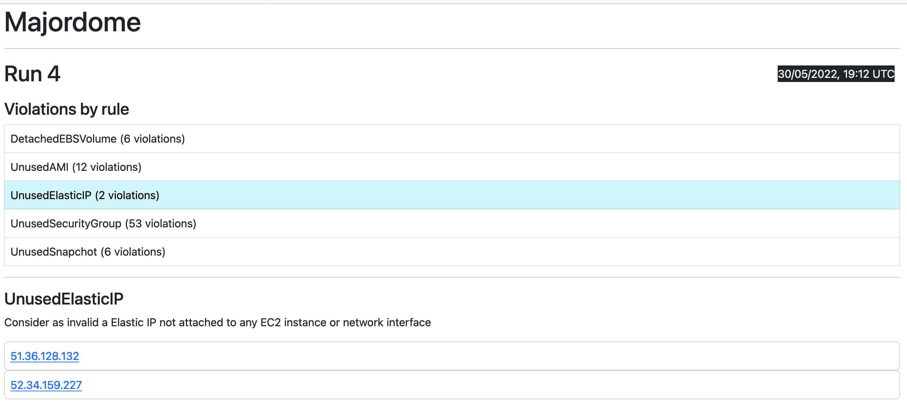

Majordome
========

[](https://app.travis-ci.com/romibuzi/majordome)

Majordome is both a command line tool and a web interface looking for unused resources on your AWS cloud based on a set of defined rules.

<p align="center">
  
</p>

Majordome has been highly inspired by Netflix's [Janitor Monkey](https://github.com/Netflix/SimianArmy/wiki/Janitor-Home),
a monkey part of the [Simian Army](http://techblog.netflix.com/2011/07/netflix-simian-army.html) which has the same goal in mind.

This is an overview of what Majordome can detect with existing rules:

- Detect an [AMI](http://docs.aws.amazon.com/AWSEC2/latest/UserGuide/AMIs.html) not used by any EC2 instance
- Detect a [EBS Volume](https://aws.amazon.com/ebs/) not attached to any EC2 instance
- Detect a Snapshot of a EBS Volume that doesn't or no more exists
- Detect a Unused [Elastic IP](http://docs.aws.amazon.com/AWSEC2/latest/UserGuide/elastic-ip-addresses-eip.html)
- Detect a Unused [Security Group](http://docs.aws.amazon.com/AWSEC2/latest/UserGuide/using-network-security.html)
- Detect a LoadBalancer without EC2 instances attached behind it

---

<details open="open">
<summary>Table of Contents</summary>

- [Configuration](#configuration)
- [Install and Run Majordome](#install-and-run-majordome)
  * [Manually](#manually)
    + [Prerequisites](#prerequisites)
    + [Run](#run)
    + [Run the web interface](#run-the-web-interface)
  * [Docker](#docker)
- [Tests](#tests)
- [FAQ](#faq)
- [License](#license)
- [Credits](#credits)

</details>

---

## Configuration

Make sure your authentication on AWS is ready, either by exporting your AWS access key and secret:

```
export AWS_ACCESS_KEY_ID='...'
export AWS_SECRET_ACCESS_KEY='...'
```

Or put them in `~/.aws/credentials` file:

```
[default]
aws_access_key_id = '...'
aws_secret_access_key = '...'
```

Finally, you have to copy `app/config.php.dist` to `app/config.php` and edit `aws.region` and `aws.accountId`. accountId must not have  `-` ex:`63383838383`, so get rid of them from your typical accountId format.

You can also specify which rule to enable or disable under the `aws.rules` key in `app/config.php`.

*Note* : To be efficient, Majordome should have extensible **read** access to different AWS resources like EC2 instances, security groups, Snapshots, Volumes and Elastic Load Balancers

This is the policy Majordome should have:
```json
{
   "Version": "2012-10-17",
   "Statement": [{
      "Effect": "Allow",
      "Action": [
         "ec2:DescribeInstances",
         "ec2:DescribeImages",
         "ec2:DescribeVolumes",
         "ec2:DescribeSnapshots",
         "ec2:DescribeAddresses",
         "ec2:DescribeSecurityGroups",
         "elb:DescribeLoadBalancers",
         "rds:DescribeDBInstances",
         "elasticache:DescribeCacheClusters"
      ],
      "Resource": "*"
   }]
}
```

Check the [aws doc](http://docs.aws.amazon.com/AWSEC2/latest/UserGuide/iam-policies-ec2-console.html) for more informations about it.

## Install and Run Majordome

### Manually

#### Prerequisites

- PHP >=7.4 with curl and sqlite3 extensions
- Sqlite3
- [Composer](https://getcomposer.org/)

```
make install
```

#### Run

```
make run
```

This will run the Majordome process, which will crawl different AWS resources and run each of them against the rule engine to decide if the resource is valid or not.

Majordome will save the run and its `violations` (a violation is when a resource is identified as invalid by a rule) under a sqlite database located at `var/majordome.db`.

#### Run the web interface

```
make run-web
```

The interface will be available at [http://localhost:8080](http://localhost:8080). It will display the list of Majordome runs and display details and associated violations for each of them.

### Docker

First build the majordome docker image:

```
make docker-build
```

Then you are able to launch the majordome process:

```
make docker-run
```

Finally launch the web interface that will be accessible at [http://localhost:8080](http://localhost:8080):

```
make docker-run-web
```

## Tests

```
make install-dev
make test
```

## FAQ

### I want to implement a new rule, is it possible ?

Yes ! The core of Majordome was designed for extensibility. There is a [RuleInterface](src/Rule/RuleInterface.php) which each rule should implements,
you can get a look to existing [rules](src/Rule/AWS).

## License

Licensed under the MIT license. See [LICENSE](LICENSE) for the full details.

## Credits

- www.freefavicon.com for the [favicon](web/favicon.ico)
